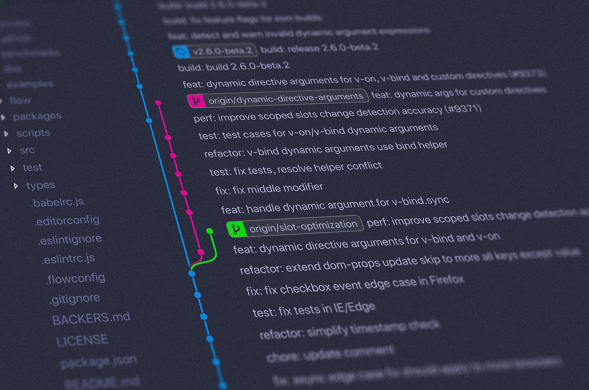

## Commit Related Changes

A commit should be a wrapper for related changes. For example, fixing two different bugs should produce two separate commits. Small commits make it easier for other developers to understand the changes and roll them back if something went wrong. With tools like the staging area and the ability to stage only parts of a file, Git makes it easy to create very granular commits.

## Commit Often

Committing often keeps your commits small and, again, helps you commit only related changes. Moreover, it allows you to share your code more frequently with others. That way it‘s easier for everyone to integrate changes regularly and avoid having merge conflicts. Having few large commits and sharing them
rarely, in contrast, makes it hard to solve conflicts.

## Do Not Commit Half-Done Work

You should only commit code when it‘s completed. This doesn‘t mean you have to complete a whole, large feature before committing. Quite the contrary: split the feature‘s implementation into logical chunks and remember to commit early and often. But don‘t commit just to have something in the repository before leaving the office at the end of the day. If you‘re tempted to commit just because you need a clean working copy (to check out a branch, pull in changes, etc.) consider using Git‘s «Stash» feature instead.

## Test Your Code Before You Commit

Resist the temptation to commit something that you «think» is completed. Test it thoroughly to make sure it really is completed and has no side effects (as far as one can tell). While committing half-baked things in your
local repository only requires you to forgive yourself, having your code tested is even more important when it comes to pushing/sharing your code with others.

## Always Write Good Commit Messages

Begin your message with a short summary of your changes (up to 50 characters as a guideline). Separate it from the following body by including a blank line. The body of your message should provide detailed answers to the following questions:

- What was the motivation for the change?
- How does it differ from the previous
  implementation?

Use the imperative, present tense («change», not «changed» or «changes») to be consistent with generated messages from commands like git merge.

## Version Control Is Not A Backup System

Having your files backed up on a remote server is a nice side effect of having a version control system. But you should not use your VCS like it was a backup system. When doing version control, you should pay attention to
committing semantically (see «related changes ») - you shouldn‘t just cram in files.

## Use Branches

Branching is one of Git‘s most powerful features - and this is not by accident: quick and easy branching was a central requirement from day one. Branches are the perfect tool to help you avoid mixing up different lines
of development. You should use branches extensively in your development workflows: for new features, bug fixes, ideas…

## Decide/Agree On A Workflow

Git lets you pick from a lot of different workflows: long-running branches, topic branches, merge or rebase git-flow… Which one you choose depends on a couple of factors: your project, your overall development and
deployment workflows and (maybe most importantly) on you and your teammates‘ personal preferences. However you choose to work, just make sure to agree on a common workflow that everyone follows.

## The Cheat Sheet

## Create a repo

Clone an existing repository:

```bash
git clone <url_of_repository>
```

Create a new local repository:

```bash
git init
```

## Local Changes

Show changed files in your working directory:

```bash
git status
```

Show changes to tracked files:

```bash
git diff
```

Add all current changes to the next commit:

```bash
git add .
```

Add some changes in <file> to the next commit:

```bash
git add -p <file>
```

Commit all local changes in tracked files:

```bash
git commit -a
```

Commit previously staged changes:

```bash
git commit
```

Change the last commit:

_Don‘t amend published commits!_

```bash
git commit --amend
```

## Commit History

Show all commits, starting with newest:

```bash
git log
```

Show changes over time for a specific file:

```bash
git log -p <file>
```

Who changed what and when in <file>:

```bash
git blame <file>
```

## Branches and Tags

List all existing branches:

```bash
git branch -av
```

Switch HEAD branch:

```bash
git checkout <branch>
```

Create a new branch based
on your current HEAD:

```bash
git branch <new-branch>
```

Create a new tracking branch based on
a remote branch:

```bash
git checkout --track <remote/branch>
```

Delete a local branch:

```bash
git branch -d <branch>
```

Mark the current commit with a tag:

```bash
git tag <tag-name>
```

## Update And Publish

List all currently configured remotes:

```bash
git remote -v
```

Show information about a remote:

```bash
git remote show <remote>
```

Add new remote repository, named <remote>:

```bash
git remote add <shortname> <url>
```

Download all changes from <remote>, but
don‘t integrate into HEAD:

```bash
git fetch <remote>
```

Download changes and directly
merge/integrate into HEAD:

```bash
git pull <remote> <branch>
```

Publish local changes on a remote:

```bash
git push <remote> <branch>
```

Delete a branch on the remote:

```bash
git branch -dr <remote/branch>
```

Publish your tags:

```bash
git push --tags
```

## Merge And Rebase

Merge <branch> into your current HEAD:

```bash
git merge <branch>
```

Rebase your current HEAD onto <branch>:

_Don‘t rebase published commits!_

```bash
git rebase <branch>
```

Abort a rebase:

```bash
git rebase --abort
```

Continue a rebase after resolving conflicts:

```bash
git rebase --continue
```

Use your configured merge tool to solve
conflicts:

```bash
git mergetool
```

Use your editor to manually solve conflicts
and (after resolving) mark file as resolved:

```bash
git add <resolved-file>
git rm <resolved-file>
```

## Undo

Discard all local changes in your working
directory:

```bash
git reset --hard HEAD
```

Discard local changes in a specific file:

```bash
git checkout HEAD <file>
```

Revert a commit (by producing a new commit
with contrary changes):

```bash
git revert <commit>
```

Reset your HEAD pointer to a previous commit:
…and discard all changes since then:

```bash
git reset --hard <commit>
```

…and preserve all changes as unstaged
changes:

```bash
git reset <commit>
```

…and preserve uncommitted local changes:

```bash
git reset --keep <commit>
```
