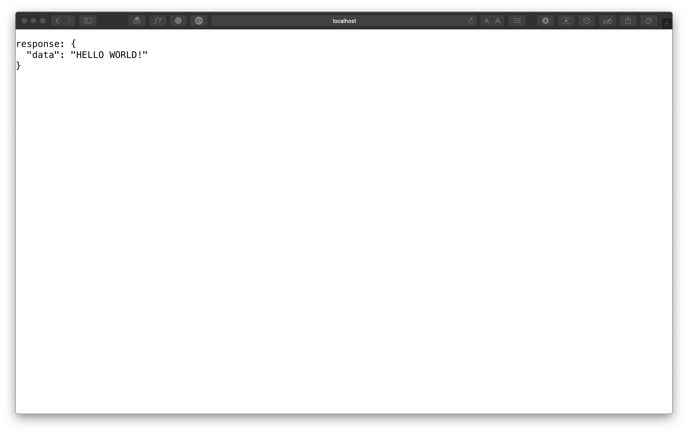

#

The React hook API means we can reuse our code, more easily than ever before. One of the most frequent things I find when building any modern web app is the ability to fetch data from a remote source, to use within our app. Lets combine both of these, and create a reusable custom React hook that we can use to pull data from any url.

## What you will learn

- Usage of create-react-app via npx
- Composition of a custom React hook
- Usage of the useState hook
- Usage of the useEffect hook
- Usage of the useRef hook
- To create a reusable useFetch hook

## Set up the project

The fastest way to get any react project up and running is by using the create-react-app package. We'll use it via `npx` rather than worrying if we have the latest version installed:

```bash
npx create-react-app my-custom-hook
```

This will bundle a project together, using webpack, react, babel and react-testing library. Pretty much everything we are going to need. If you fancy doing it manually, I have a <a target="_blank" rel="noopener noreferrer" href="https://www.self-taught-and-fraught.com/development/webpack-react-babel-2020/" title="webpack, react and babel, 2020">post</a> that explains that. But for now, create-react-app is perfect for our needs.

`cd` into the root of the project:

```bash
cd my-custom-hook
code .
```

This will open in your favorite IDE, (mine is vscode, but it really doesn't matter which you use), and replace the contents of `./src/App.js` with:

```js
// ./src/App.js
import React from 'react'

function App() {
  return <h1>useFetch()</h1>
}

export default App
```

At this point its always worth, starting the app and opening your `developer console` and checking that the app runs and without any errors:

```bash
yarn && yarn start
```

## Considerations

- **response** - Our custom hook wants be a function, that accepts two arguments, although only the first argument is required. The first argument is the `URL` of the remote source, and it should be a `string`. The second argument, if present is the `header` and so should be always an `object`. This header can contain information like setting the `method` to `POST`, `UPDATE`, `DELETE` etc, setting the `body`, supplying `tokens` etc. When the data is return, it should be an `object`.

- **error** - We need to consider what happens if the server is down and there is an error. This should be an error `object`.

- **isLoading** - We should also note that making a request to an external data source such as a `REST_API` is asynchronous, and so we need to be able to handle the `load-state` (whether it is loading or is loaded). Due to its nature it should be a `boolean`.

Just so we are aware of what we are trying to achieve, type the following into our terminal:

```bash
curl 'https://jsonplaceholder.typicode.com/users/5'
```

This url is for a `REST_API`, when we make an `http` `GET` request to it, it will return a data object. It is **this** object that we expect our hook to return when we are finished.

## Create the required API

When creating hooks like this, I prefer to reverse engineer them. So I am going to start with how I **want** our custom hook to work. Replace `./src/App.js` again, but this time with:

```js
import React from 'react'
import { useFetch } from ',/useFetch'

const App = () => {
  const [response, error, isLoading] = useFetch(
    `https://jsonplaceholder.typicode.com/users/5`
  )

  if (isLoading) {
    return <h1>Loading..</h1>
  }

  if (error) {
    console.log(error.message)
  }

  return (
    <>
      <pre>response: {JSON.stringify(response, null, 2)}</pre>
    </>
  )
}

export default App
```

Lets discuss this code change.

```js
import { useFetch } from ',/useFetch'
```

Imports the hook from its source, we haven't created this yet, but do not worry.

```js
const [response, error, isLoading] = useFetch(
  `https://jsonplaceholder.typicode.com/users/5`
)
```

This is our API. This is how we want our custom hook to work. For this example, I'm only going to use the first argument, and directly enter the `URL` string.

We then want to deconstruct the three considerations that we drew up before `response`, `error` and `isLoaded`.

I am deconstructing these from an `array` rather than an `object`. This means they are not `name bound` so I could use this naming convention:

```js
const [userData, userError, userLoading] = useFetch(
  `https://jsonplaceholder.typicode.com/users/5`
)
```

> This is important if we want to use the useFetch hook twice in the same component (ie: grab the users location data and then grab the weather data based on that location data). By using it more than once, there would be a naming conflict if we deconstructed from an `object`. (attempting to reassign the constant variable `response`, multiple times with multiple responses). Because of this, the order of this deconstruction is very important. For example, we cannot request just the `[response, isLoaded]` as could be done with object deconstruction, because the information in the `isLoaded` placeholder would actually be the `error` information (the second item in the returned array `[response, error, isLoaded]`).

We can then handle each of our considerations. The `error` conditional allows the us to handle error. The `isLoading` conditional allows the us to handle the case of when the data is still loading, for example on a slower, older mobile device. Use cases for loading states tend to be `progress bars`, or `spinners`.

Only if there there are no errors **and** the loading has been completed will the we hit our final return statement:

```js
return (
  <>
    <pre>response: {JSON.stringify(response, null, 2)}</pre>
  </>
)
```

Because this is a demo, all we are returning is a React.Fragment which will display the `response` object, using two spaces for the tab.

So, obviously now our project won't run. and we haven't even started on the hook! This is fine, we have actually already achieved quite a lot, we know the shape of the API from our three considerations, we also identified handling multiple use cases in the same component.

Lets start with (from the root of the project):

```bash
cd src
touch useFetch.js
```

Inside `./src/useFetch.js` we can mock our hook out, by using the considerations we made earlier:

```js
//./src/useFetch.js
import React from 'react'

const useFetch = (url, options) => {
  const response = { data: 'HELLO WORLD!' }
  const error = false
  const isLoading = false

  return [response, error, isLoading]
}

export { useFetch }
```

Lets see our mock in action, return to the root directory in the terminal and start the application:

```bash
cd ..
yarn && yarn start
```



So the mock works, and we've made really good progress. Now lets make some more considerations:

- **useState** - We will utilize the useState hook, to store our three variables in the components state.

- **useEffect** - We will want to make use of the useEffect hook, it will allow us to run a function, and define a dependencies array. We can place the two arguments that the initial function call receives (the url and maybe the options) inside this dependency array. That way, the hook will trigger every time it receives a new url. This is essential if we expect to use the hook multiple times in the same component.

- **useRef** - useEffect can also return a callback function, if present it does this as the component is being unmounted from the DOM. This callback function can be used for clean up. In our case we can use the useRef hook as a placeholder for the components mounted state. This will allow us to record the mounting and un-mounting of this component, and thus preventing memory leaks.

- **fetch API** - We will use the fetch method to make an http GET request, passing its response into our components state.

- **response** - We will want to create the object to be returned inside the response. As stated before, it must be an object, and we can use it to attach other, helpful information to the response object.

- **error** - if the fetch API receives an error, it is this error that will be passed into our components state and then returned as an error object.

- **isLoading** - , pass it into the components state, and then return the value as a boolean.

Lets edit `./src/useFetch.js` taking all of these new considerations into account:

```js
import React from 'react'

const useFetch = (url, options) => {
  const isMounted = React.useRef(true)
  const [response, setResponse] = React.useState({})
  const [error, setError] = React.useState(false)
  const [isLoading, setIsLoading] = React.useState(false)

  React.useEffect(() => {
    if (isMounted.current) {
      if (!url) {
        return
      }

      setIsLoading(true)

      const fetchData = async function () {
        const response = await fetch(url, options)
          .then((res) => res.json())
          .then((jsonData) => {
            setIsLoading(false)
            setResponse({
              'end-point': url,
              status: 200,
              error: false,
              'data-type': Array.isArray(jsonData) ? 'array' : typeof jsonData,
              'data-length': jsonData.length,
              data: jsonData,
            })
          })
          .catch((err) => {
            setIsLoading(false)
            setError({ error: true, message: err })
          })
      }
      fetchData()
    }

    return () => {
      isMounted.current = false
    }
  }, [url, options])

  return [response, error, isLoading]
}

export { useFetch }
```

Lets discuss this code change.

The `useRef` hook will set `ref.current` to true. We'll use this in a moment.

We define our three variables as pieces of component state.

Inside the `useEffect` hook, we start with a conditional based on the `ref` we just created. Meaning we can only fetch data whilst it is true. When the callback function is returned from the `useEffect` hook (ie when the component unmounts), we set it to false. It is now not possible to fetch data when the component is un-mounted. This prevents a very common error whilst fetching data, memory leaks.

We then use the fetch API, parse the response, and assign the parsed data to our response object. Non of this is actually necessary, you could just return the parsed data. Personally I like the additional data, and seeing as this is a reusable component, I hope to catch other use cases further down the road.

The full project can be seen [here](https://github.com/RickBr0wn/use-fetch)

##### ✏️ [Rick Brown](https://github.com/RickBr0wn)

##### 📷 [Rob Fuller](https://unsplash.com/@robfuller?utm_source=unsplash&utm_medium=referral)
